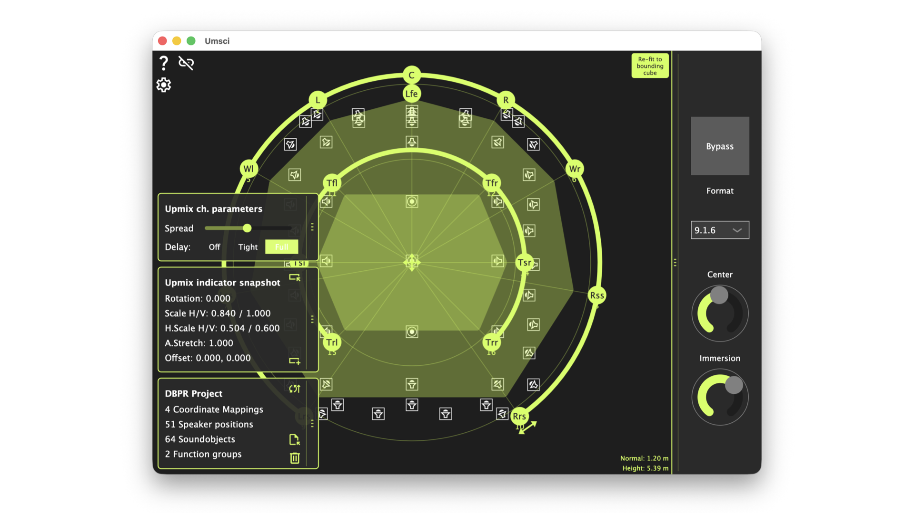

# Umsci

A spatial audio control surface for d&b Soundscape. See the room, move objects, align an upmix renderer's output to the physical speaker layout, and drive the renderer's own parameters — all from one interface, in real time.

::: {.cta}
[Download latest release](https://github.com/ChristianAhrens/Umsci/releases/latest)

[API Documentation](doxygen/)

[GitHub Repository](https://github.com/ChristianAhrens/Umsci)
:::

---

## What it does

Umsci connects to a **d&b Soundscape processing engine** (DS100, DS100M, DS100D, DS110 or vCore) over the OCA/OCP.1 network protocol and renders a live 2D top-down map of the room as configured in the processing engine. Three transparent layers share the same coordinate space: loudspeaker icons at the bottom, draggable sound object circles in the middle, and an interactive upmix indicator ring on top.

Its core workflow addresses the **upmix alignment problem**: an external upmix renderer — a standalone application, DAW plug-in or hardware processor — produces a set of spatialised output channels fed into consecutive sound objects on the processing engine. Umsci gives a single graphic handle on that block of objects. Drag five transform handles on the indicator ring to rotate, scale, stretch and shift the virtual speaker geometry until it matches the physical room. In Live mode every adjustment is forwarded to the processing engine in real time.

Beyond alignment, Umsci can also send OSC messages directly to the upmix renderer itself, so its internal parameters — such as room size, reverb characteristics or format-specific controls — can be adjusted from the same interface without switching to the renderer's own UI.

## The scene view

All three layers render in the same normalised coordinate space used by the processing engine and share the same zoom and pan state:

| Layer | Content |
|:------|:--------|
| Bottom | Physical loudspeaker positions read from the processing engine — display only. |
| Middle | Live sound object positions, draggable in Live mode. |
| Top | Upmix indicator ring with interactive transform handles. |

Zoom and pan via mouse wheel, trackpad pinch, or two-finger touch on iOS/iPadOS.

## Upmix indicator control

The indicator ring represents the ideal geometry for the selected immersive format — from Stereo up to 9.1.6 Atmos. Five interactive handles let you adapt it to the physical room without entering coordinates manually:

- **Ring arc drag (tangential)** — rotates both floor and height rings together
- **Ring arc drag (radial, floor)** — scales floor ring width and height independently
- **Ring arc drag (radial, height)** — scales height ring independently of the floor ring
- **Centre cross drag** — shifts the ring centre in XY
- **Stretch arrow drag** — compresses or expands front/rear angular spread
- **Refit button** — auto-fits the ring to the loudspeaker bounding box in one click

Double-click any handle to reset it to its default. Both Circle and Rectangle indicator shapes are supported.

### Control modes

| Mode | Behaviour |
|:-----|:----------|
| **Manual** | Geometry changes are previewed locally. Double-click to commit positions to the processing engine. |
| **Live** | Every handle movement is sent to the processing engine immediately. Echo-backs from the processing engine are absorbed to prevent spurious visual feedback. |

## MIDI external control

All eight upmix transform parameters — rotation, floor H/V scale, height H/V scale, angle stretch, and XY offset — can be mapped to MIDI continuous controllers via a MidiLearner dialog. Click Learn on a parameter row, move the controller, and the assignment is captured automatically. MIDI control works alongside all other interaction modes with no switching required.

## OSC renderer control

Umsci can send OSC messages directly to a upmix renderer — whether it is a standalone application, a DAW plug-in (via a virtual OSC bridge) or a hardware unit with an OSC interface. Custom parameter mappings are configured in Umsci's settings: assign an OSC address and value range to each renderer parameter you want to expose, and those controls become available alongside the spatial view.

This closes the loop between spatial alignment and renderer operation. Instead of switching back and forth between Umsci and the renderer's own UI, the complete upmix workflow — geometry alignment, live processing-engine position updates and renderer parameter adjustments — is accessible from a single interface.

## d&b project integration

Load a `.dbpr` d&b audiotechnik software project file to use as a reference. Umsci reads coordinate mappings, speaker positions, sound object names and function groups from the file's internal SQLite database and displays a compact summary. Continuous mismatch detection highlights any divergence between the loaded project data and the live processing-engine state; a single Sync button pushes the project data back to the device.

## iOS and iPadOS

Umsci runs natively on iOS and iPadOS with full touch support: two-finger pinch zoom on the scene view, correct safe-area handling for notch, Dynamic Island and home indicator, and automatic discovery of Soundscape processing engines via Zeroconf/mDNS — no IP address required. An iPad or iPhone becomes a wireless spatial control surface for any Soundscape processing engine reachable on the local network.

## Getting started

1. Open **Settings → Connection settings** and enter the processing engine's IP address, port (`50014`) and the IOsize matching your device license (`64x64` for L, `128x64` for XL).
2. Click the connection toggle in the top-right corner. Loudspeaker icons and live sound object positions populate the scene view.
3. Open **Settings → Upmix control settings**, select the channel format your upmix renderer produces and the first processing-engine input it occupies.
4. Click **Refit** on the indicator ring as a starting point, then drag handles to align the geometry with the physical speaker layout. Switch to Live mode to send positions in real time.

The full step-by-step walkthrough, settings reference and architecture documentation are in the [README](https://github.com/ChristianAhrens/Umsci/blob/main/README.md).

## Platform support

| Platform | Notes |
|:---------|:------|
| macOS | Desktop app; mouse wheel and trackpad pinch zoom. |
| Windows | Desktop app; mouse wheel zoom. |
| iOS / iPadOS | Native app; full touch, pinch zoom, Zeroconf discovery. TestFlight beta available. |

## Get it

Binary packages for macOS and Windows are attached to every [GitHub release](https://github.com/ChristianAhrens/Umsci/releases/latest). The iOS TestFlight beta is linked from the [repository page](https://github.com/ChristianAhrens/Umsci#readme).

Source code, build scripts and full technical documentation are in the [GitHub repository](https://github.com/ChristianAhrens/Umsci). Code-level API documentation is in the [Doxygen reference](doxygen/).
