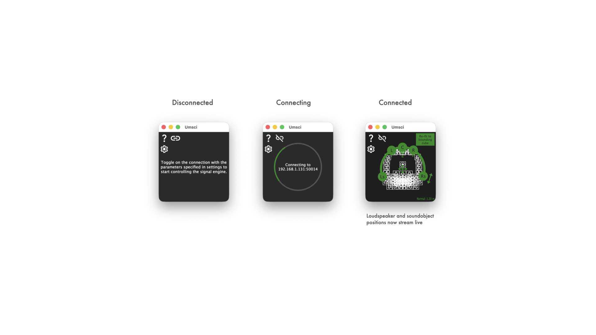
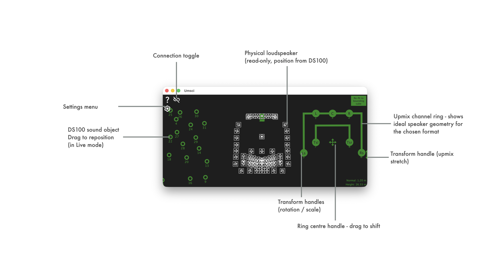
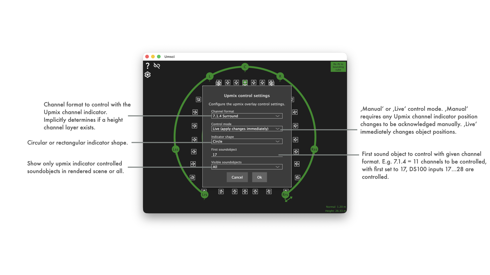
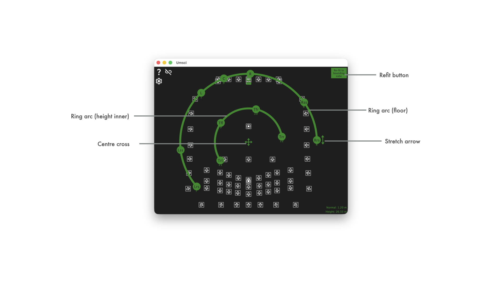
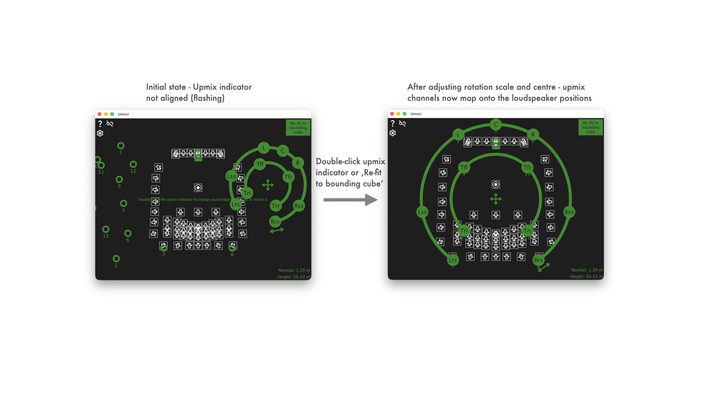
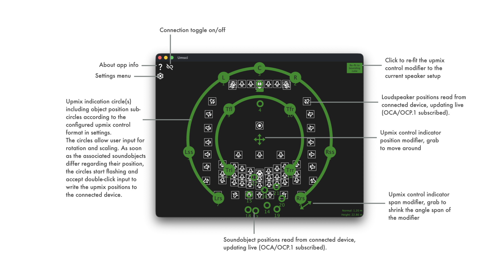

See [LATEST RELEASE](https://github.com/ChristianAhrens/Umsci/releases/latest) for available installer packages or join iOS TestFlight Beta:


Full code documentation available at [](https://ChristianAhrens.github.io/Umsci/)

<a name="toc" />

## Table of contents

* [Overview](#overview)
* [Getting started](#getting-started)
  * [Step 1 — Configure the connection to the signal engine](#step1-connection-config)
  * [Step 2 — Connect and verify](#step2-connect)
  * [Step 3 — Read the scene](#step3-scene)
  * [Step 4 — Set up and adjust the upmix indicator](#step4-upmix)
* [Use cases](#use-cases)
* [Umsci - app functionality](#Umsci-app-functionality)
  * [Main Umsci UI](#Umsci-ui)
    * [Upmix indicator handles](#upmix-indicator-handles)
    * [Zoom and pan](#zoom-and-pan)
    * [Control modes](#control-modes)
  * [Side panels](#side-panels)
    * [dbpr project panel](#dbpr-project-panel)
    * [Snapshot panel](#snapshot-panel)
  * [Umsci settings menu](#Umsci-settings-menu)
  * [Connection settings](#connection-settings)
  * [Upmix control settings](#upmix-control-settings)
  * [External control (MIDI)](#external-control-midi)
* [Platform support](#platform-support)
* [Command-line parameters](#commandlineparameters)
* [Code architecture](#code-architecture)
  * [Component stack](#component-stack)
  * [Zoom and pan internals](#zoom-and-pan-internals)
  * [iOS native touch handling](#ios-native-touch-handling)
  * [Configuration persistence](#configuration-persistence)
  * [MIDI control internals](#midi-control-internals)
  * [dbpr project loading internals](#dbpr-project-loading-internals)


<a name="overview" />

## Overview

Umsci is a utility that connects to a **d&b Soundscape** signal processing engine (DS100) via the OCA/OCP.1 network protocol and lets an operator visualise and control soundobject positions in real time.

Its primary focus is the specific workflow of mapping an external **upmix renderer's** virtual output channels onto the physical room layout managed by the DS100.  An upmix renderer (e.g. a DAW plug-in or hardware processor) takes a stereo or surround bus and produces a set of spatialised output channels that should be fed into consecutive DS100 sound objects.  Umsci gives the operator a graphical handle on that block of sound objects, letting them rotate, scale, stretch and shift the entire virtual speaker ring to best match the physical loudspeaker array — while watching how the actual DS100 positions track the intended geometry.

The application subscribes to all soundobject and loudspeaker position values published by the DS100 and renders them on a shared 2D view that blends three overlaid layers: the physical loudspeaker layout (read-only), the live soundobject positions (interactive), and the upmix indicator control ring.

Its source code and prebuilt binaries are made publicly available to enable interested users to experiment, extend, and create their own adaptations.

Use what is provided here at your own risk!


<a name="getting-started" />

## Getting started

This walkthrough assumes you have a **d&b Soundscape DS100** signal processing engine reachable on your local network and an upmix renderer (DAW plug-in, hardware processor, or similar) feeding output channels into consecutive DS100 sound objects.  If you only want to monitor or edit soundobject positions without the upmix workflow, steps 3 and 4 are still fully relevant — simply ignore the upmix-specific parts.

---

<a name="step1-connection-config" />

### Step 1 — Configure the connection to the signal engine

Open the **Settings menu** by clicking the gear icon (⚙) in the upper-left corner of the Umsci window, then choose **Connection settings…**.


Enter the **IP address** of your DS100, leave the **port** at the default `50014`, and set the **IOsize** to match your DS100 license (`64x64` for L, `128x64` for XL) — a mismatched IOsize will prevent the connection from completing.  The *Discovered devices* drop-down lists DS100 devices found automatically via mDNS; selecting one fills in the address and port.

Press **Ok** to store the settings.  See [Connection settings](#connection-settings) for the full field reference.

---

<a name="step2-connect" />

### Step 2 — Connect and verify

Click the **connection toggle button** in the upper-right corner of the main window.  The button cycles through *disconnected → connecting → connected* states.


Once the button settles into the *connected* state the three scene layers populate automatically:

- **Loudspeaker icons** appear at the positions stored in the DS100 (bottom layer, display-only).
- **Soundobject circles** appear at their live positions and can be dragged (middle layer).
- The **upmix indicator ring** appears if a format other than *None* is selected (top layer).

If the button does not reach the connected state, double-check the IP address, port, and IOsize values from Step 1.  A mismatch between the IOsize and the actual DS100 license is the most common cause.

---

<a name="step3-scene" />

### Step 3 — Read the scene

The main view is a shared 2D top-down representation of the physical room as configured in the DS100.  All coordinates use the DS100's normalised 0–1 space (X = left → right, Y = front → back).



Key things to notice:

| Element | What it tells you |
|:--------|:-----------------|
| Loudspeaker icons | The physical layout of the room as seen by the DS100. They do not move unless you change the DS100 configuration elsewhere. |
| Soundobject circles | Live positions of all DS100 inputs.  Their colour matches the chosen *Control colour*. |
| Upmix ring arc | The idealised geometry for the selected immersive format (Stereo → 9.1.6), centred at the ring's transform-adjusted origin. |
| Coloured dots on the ring (Live mode) | Actual DS100 positions for the upmix channels.  A flashing dot means Umsci just sent an update and is waiting for the DS100 echo. |

Use the mouse wheel or a trackpad/touch pinch to zoom, and a modifier key + scroll to pan — see [Zoom and pan](#zoom-and-pan) for all input options.

---

<a name="step4-upmix" />

### Step 4 — Set up and adjust the upmix indicator

The upmix indicator ring is the core workflow tool.  This step walks through configuring it and using its interactive handles to align the virtual speaker ring with the physical room layout.

#### 4a — Choose the channel format and first soundobject

Open **Settings → Upmix control settings…**.  The two settings that matter most at first are:

- **Channel format** — the immersive format your renderer produces (e.g. `7.1.4` for a 12-channel Atmos bed).
- **First soundobject** — the 1-based DS100 input channel where your renderer's output starts (e.g. `17` if the renderer occupies channels 17–28).

Start with **Control mode** set to *Manual* so you can preview adjustments before committing them, and leave **Indicator shape** at *Circle* unless your room is clearly rectangular.  See [Upmix control settings](#upmix-control-settings) for all options.



Press **Ok**.  The ring updates to show the correct number of channel spokes and labels for the chosen format.

#### 4b — Align the ring to the room

Use the five interactive handles on the ring to match the idealised geometry to the physical loudspeaker layout visible in the bottom layer.  A practical starting point: click the **Refit button** (top-right of the ring) to auto-fit the ring to the loudspeaker bounding box, then fine-tune **rotation** and **centre offset** to taste.  Double-click any handle to reset it to its default.  See [Upmix indicator handles](#upmix-indicator-handles) for a description of all five handles.



#### 4c — Commit the positions (Manual mode) or work live

- **Manual mode:** drag the handles to the desired geometry, then **double-click** the ring or a handle to push the positions to the DS100.  The soundobject circles in the middle layer will jump to match.
- **Live mode:** every handle drag immediately sends updated positions to the DS100.  The coloured dots on the ring show the DS100's echoed-back positions tracking your adjustments in real time.

See [Control modes](#control-modes) for a full comparison.



Once the ring is aligned and positions are committed, Umsci will hold the subscriptions to all DS100 position values.  Any external position change (from a third-party controller, automation, or another Umsci instance) will be reflected live in the scene view. Any conflicting changes will set the upmix indicator back to flashing state to visualise that it is not aligned.

---

<a name="use-cases" />

## Use cases

### Upmix monitoring and alignment

The primary use case: an external upmix renderer outputs N channels (e.g. 16 channels for a 7.1.4 Atmos bed) into DS100 sound objects starting at a configurable channel index.  Umsci shows the idealised ring geometry for the chosen channel format (Stereo through 9.1.6) superimposed over the physical loudspeaker layout.  The operator can interactively adjust rotation, scale, height and front/rear stretch to align the virtual ring with the available speakers, and in *Live* mode the DS100 positions are updated in real time as the handles are dragged.

### General soundobject position monitoring and editing

All DS100 sound objects (up to 64 / 128 depending on the M / L / XL license installed in the signal engine) are rendered as draggable circles.  Even without the upmix focus, Umsci provides a quick spatial overview of the full object set and allows individual objects to be repositioned from any connected device.

### Kiosk / embedded control surface

Using the `--noconfigui` and `--noupdates` command-line flags, Umsci can be locked into a minimal, touch-friendly control surface where settings dialogs and update notifications are hidden.  This is suited for fixed installations where the operator should only move objects and adjust the upmix transform, without access to connection or configuration options.

### iOS / iPadOS mobile control

Umsci runs natively on iOS/iPadOS.  The full touch interaction model — including two-finger pinch zoom on the scene view — is supported.  An iPad can act as a wireless remote control surface for a DS100 on the same network, using Zeroconf/mDNS auto-discovery to find the device without entering an IP address manually.

---

<a name="Umsci-app-functionality" />

## Umsci - app functionality

<a name="Umsci-UI" />

### Main Umsci UI



The main view shows three transparent layers stacked on top of each other — all sharing the same coordinate space and zoom/pan state:

| Layer | Content |
|:------|:--------|
| **Bottom** | Loudspeaker positions read from the DS100 (SVG icons, display only). |
| **Middle** | Soundobject positions, updated live via OCP.1. Draggable in Live mode. |
| **Top** | Upmix indicator ring with interactive transform handles (see below). |

The connection toggle button (top-right) shows the live OCP.1 connection state and can be clicked to connect or disconnect.

<a name="upmix-indicator-handles" />

#### Upmix indicator handles

The top layer renders a ring (circle or rectangle path) representing the ideal speaker positions for the chosen immersive format.  Five handles allow the ring geometry to be adjusted:

| Handle | Gesture | Effect |
|:-------|:--------|:-------|
| Ring arc (floor) | Drag tangentially | Rotates the ring (±180°). |
| Ring arc (height, inner) | Drag radially | Scales the height ring relative to the floor ring. |
| Centre cross | Drag | Shifts the ring centre in XY. |
| Stretch arrow | Drag along arrow | Compresses or expands the front/rear angular spread. |
| Refit button (top-right) | Click | Snaps the transform so the ring fits inside the loudspeaker bounding box. |

Double-clicking a handle resets that parameter to its default value.

When *Live mode* is active, coloured dots show the actual DS100 source positions for the upmix channels overlaid on the ideal ring, allowing the operator to see alignment errors and oscillations in real time.  A flashing dot indicates that the DS100 is echoing back position updates (normal behaviour during active control).

<a name="zoom-and-pan" />

#### Zoom and pan

The scene view supports zoom and pan on all platforms:

| Input | Action |
|:------|:-------|
| Mouse wheel (scroll up/down) | Zoom in/out centred on cursor position. |
| Trackpad two-finger pinch | Zoom in/out centred on gesture midpoint. |
| Two-finger touch pinch (iOS/iPadOS) | Zoom in/out centred on gesture midpoint (native UIKit gesture recognizer). |
| Mouse wheel while pressing a modifier key | Pan horizontally / vertically. |

The zoom level is shared across all three layers so they stay aligned.

<a name="control-modes" />

#### Control modes

The *Control mode* setting (in *Upmix control settings*) governs how soundobject position changes originating from Umsci are sent to the DS100:

| Mode | Behaviour |
|:-----|:----------|
| **Manual (double-click to apply)** | Dragging or adjusting handles updates the on-screen geometry locally. The new positions are only sent to the DS100 when the user double-clicks the ring or handle. Use this mode when you want to preview a new layout before committing it. |
| **Live (apply changes immediately)** | Every position change is sent to the DS100 in real time as the user drags. DS100 echo-backs are automatically absorbed so they do not produce spurious visual feedback. |

<a name="side-panels" />

### Side panels

Two collapsible side panels live at the left edge of the main window and are accessible at all times — no menu required.  Each panel has a **grab strip** (the narrow vertical bar visible at the left edge) that can be clicked to slide the panel in or out.

")

<a name="dbpr-project-panel" />

#### dbpr project panel

The dbpr panel (lower of the two) lets you load a **d&b audiotechnik software project file** (`.dbpr`) and use it as a reference for the currently connected DS100.

**Loading a project**

Click the **Load** button (folder icon) to open a file browser and select a `.dbpr` file.  Umsci reads the following tables from the file's internal SQLite database:

| Table | What it provides |
|:------|:-----------------|
| `MatrixCoordinateMappings` / `VenueObjects` | Coordinate mapping areas (virtual-point corners, real-point corners). |
| `MatrixOutputs` | Speaker positions and aiming angles. |
| `MatrixInputs` | Sound object names and En-Scene flags (`InputMode`). |
| `FunctionGroups` | Function group names and operating modes. |

A condensed summary is shown in the panel, e.g. *4 CMP · 52 SPK · 48 SO · 8 FG*.

> **Note:** Umsci only supports projects with a single DS100.  Projects that reference multiple device IDs, or that contain no En-Scene matrix inputs, are rejected with an error message.

**Comparing project data to the device**

Once a project is loaded and a DS100 is connected, Umsci continuously compares the project data against the values reported by the device.  If any mismatch is detected, the panel border and a sync-problem icon next to the title begin to **flash** to draw attention.

**Syncing project data to the device**

Click the **Sync** button (upload icon) to push the loaded project data to the connected DS100 in a single step.  After a successful sync the flashing stops and the panel returns to its steady-state appearance.

**Clearing project data**

Click the **Clear** button (trash icon) to discard all loaded project data.  The panel returns to the empty state.  The DS100 is not modified by this action.

**Persistence**

The loaded project data is saved to the XML configuration file so it is automatically restored the next time Umsci starts.

<a name="snapshot-panel" />

#### Snapshot panel

The snapshot panel (upper of the two) stores and recalls a single upmix transform snapshot — a frozen copy of all six transform parameters (rotation, scale, height, angle stretch, offset X/Y).

| Button | Action |
|:-------|:-------|
| **Store** | Captures the current upmix transform into the panel.  The six parameter values are displayed as a summary. |
| **Recall** | Applies the stored snapshot to the upmix indicator.  In *Live* mode the positions are immediately sent to the DS100. |

The snapshot is held in memory for the session; it is not persisted to the config file.

---

<a name="Umsci-settings-menu" />

### Umsci settings menu



The gear button (top-left) opens the settings menu.  Available options:

| Group | Options |
|:------|:--------|
| **Look & feel** | Follow host / Dark / Light. |
| **Control colour** | Green / Red / Blue / Anni Pink / Laser. |
| **Control format** | Stereo, LRS, LCRS, 5.0, 5.1, 5.1.2, 7.0, 7.1, 7.1.4, 9.1.6 — sets the upmix ring channel geometry. |
| **Control size** | S / M / L — scales the soundobject, speaker icons, and side panels. |
| **Connection settings…** | OCP.1 IP/port/IO-size configuration (see below). |
| **Upmix control settings…** | Upmix mode, shape, channel-start and visibility configuration (see below). |
| **External control…** | MIDI assignment for the six upmix transform parameters (see below). |
| **Fullscreen** | Toggles fullscreen / windowed mode (also F key or Escape). |

The control format determines how many channels the upmix ring has and which speaker labels are shown (L, C, R, Ls, Rs, Ltf, Rtf, etc.).  Supported formats span from simple Stereo (2 channels) up to 9.1.6 Atmos (16 channels).

<a name="connection-settings" />

### Connection settings

Opens the *Control connection settings* dialog.  Configure:

- **OCP.1 IP** — the network address of the d&b Soundscape signal engine (DS100).  On iOS/iPadOS the *Discovered devices* combo box automatically lists DS100 devices found via Zeroconf/mDNS on the local network; selecting one fills in the IP and port fields automatically.
- **OCP.1 port** — default `50014`.
- **OCP.1 IOsize** — the input × output channel count matching the software license installed in the DS100 signal engine.  Enter as `<inputs>x<outputs>`, for example `64x64` for an L license or `128x64` for an XL license.  This controls how many soundobject and loudspeaker subscriptions Umsci creates.

> **Beware:** The IOsize defines how many channels are expected to be available on the signal engine, and Umsci will not finish the connection and subscription cycle if this expectation is not met by the actual available device!

Changes take effect on **Ok**; the connection toggle button in the top-right corner shows the live connection state.

<a name="upmix-control-settings" />

### Upmix control settings

Opens the *Upmix control settings* dialog.  Configure:

- **Channel format** — the channel format whose geometry is used when applying positions (Stereo through 9.1.6). This takes into account the actual immersive format geometry definitions, esp. angles.
See e.g.
  - [ITU-R BS.775-4](https://www.itu.int/dms_pubrec/itu-r/rec/bs/R-REC-BS.775-4-202212-I!!PDF-E.pdf)
  - [ITU-R BS.2159-9](https://www.itu.int/dms_pub/itu-r/opb/rep/R-REP-BS.2159-9-2022-PDF-E.pdf)
  - [Dolby Atmos speaker setup guides](https://www.dolby.com/about/support/guide/speaker-setup-guides/)
- **Control mode** — see [Control modes](#control-modes) above.
- **Indicator shape** — *Circle* (default) draws the upmix ring as a circular arc; *Rectangle* draws it as a rounded rectangle path.  Choose based on which shape better matches the physical loudspeaker layout of the venue.
- **First soundobject** — the 1-based DS100 input channel index where the upmix renderer's output starts.  If the upmix renderer occupies channels 17–32, set this to `17`.  Subsequent channels are implied consecutively up to the channel count of the selected format.
- **Visible soundobjects** — *All* shows every soundobject in the scene; *Upmix controlled only* hides all soundobjects that are not part of the current upmix channel block, reducing visual clutter when the DS100 carries many other sources.

<a name="external-control-midi" />

### External control (MIDI)

Opens the *External control* dialog.  Allows each of the six upmix transform parameters to be driven by a MIDI continuous controller, enabling control from a hardware surface, DAW automation, or any other MIDI source.

#### MIDI input device

Select the MIDI input device from the combo box at the top of the dialog.  The selection is persisted across sessions.

#### Parameter assignments

Each parameter has a **MidiLearner** row that supports both value-range and command-range assignment:

| Parameter | Default range | Description |
|:----------|:-------------|:------------|
| **Rotation** | −180° … +180° | Rotates the entire ring. CC mid-point = 0° (front). |
| **Translation (scale)** | 0 … 3 | Radial scale of the floor ring. 1.0 = nominal radius. |
| **Height translation** | 0 … 2 | Height ring radius as a fraction of the floor ring. 0.6 = default (40 % smaller). |
| **Angle stretch** | 0 … 2 | Compresses/expands front–rear angular spread. 1.0 = uniform. |
| **Offset X** | −2 … +2 | Shifts the ring centre left/right in units of base radius. |
| **Offset Y** | −2 … +2 | Shifts the ring centre front/back in units of base radius. |

Click **Learn** on a row and move a MIDI controller to capture its CC number and value range automatically.  The assignment maps the learned CC range linearly to the full parameter range.

Changes are applied only when **Ok** is pressed; **Cancel** discards any edits.  Assignments are persisted in the XML configuration file.

> **Note:** In *Live* mode, MIDI parameter changes are immediately forwarded to the DS100 as OCP.1 position updates.  DS100 echo-backs are automatically suppressed so that they do not cause spurious indicator flashing.


<a name="platform-support" />

## Platform support

| Platform | Notes |
|:---------|:------|
| **macOS** | Desktop app; mouse wheel and trackpad pinch zoom supported. |
| **Windows** | Desktop app; mouse wheel zoom supported. |
| **iOS / iPadOS** | Native app; full touch support including two-finger pinch zoom.  Safe-area insets (notch, Dynamic Island, home indicator, Stage Manager) are handled automatically.  Zeroconf device discovery is available in connection settings. |

All platforms share the same XML configuration format.  The configuration file is stored in the platform's standard application data directory.

### Kiosk and embedded deployment

Two command-line flags simplify locked-down installations (see [Command-line parameters](#commandlineparameters)):

- `--noconfigui` hides the About, Settings, and Connection buttons so the user can only interact with the scene view.
- `--noupdates` disables the startup update check, required in network-restricted environments.

On iOS, the app can be distributed via TestFlight or an MDM solution and configured at first launch; subsequent launches restore the persisted XML config automatically.


<a name="commandlineparameters" />

## Command-line parameters

Umsci has a set of command-line parameters.  Parameters are passed directly when launching the executable from a terminal or as part of a launch script.

| Parameter | Description |
|:----------|:------------|
| `--noupdates` | Disables the automatic online update check performed by `JUCEAppBasics::WebUpdateDetector` at startup.  Useful in network-restricted environments, automated deployments, or kiosk setups where outbound HTTP requests to GitHub should be avoided. |
| `--noconfigui` | Hides the three configuration buttons (About, Settings, Connection) in the upper-left corner of the UI.  Intended for kiosk or embedded deployments where the user should not be able to change settings or disconnect from the soundscape signal engine. |


<a name="code-architecture" />

## Code architecture

This section is aimed at developers who want to understand, extend, or adapt the codebase.

<a name="component-stack" />

### Component stack

The visual output is produced by three `UmsciPaintNControlComponentBase`-derived components held by `UmsciControlComponent`, all given identical pixel bounds:

```
UmsciControlComponent
  ├── UmsciLoudspeakersPaintComponent           (bottom — display only)
  ├── UmsciSoundobjectsPaintComponent           (middle — draggable source circles)
  └── UmsciUpmixIndicatorPaintNControlComponent (top — ring + transform handles)
```

All three inherit `UmsciPaintNControlComponentBase` which provides:
- Coordinate transforms between pixel space and real-world DS100 coordinates (`GetPointForRealCoordinate` / `GetRealCoordinateForPoint`).
- Zoom/pan state (`m_zoomFactor`, `m_zoomPanOffset`) driven by mouse wheel, trackpad pinch, and on iOS a native `UIPinchGestureRecognizer` (see below).
- A `setZoom()` / `resetZoom()` API so that `UmsciControlComponent` can keep all three layers synchronised via the `onViewportZoomChanged` callback.
- A virtual `onZoomChanged()` hook that derived classes override to re-trigger their prerender pass before repaint.

`UmsciUpmixIndicatorPaintNControlComponent` also inherits `JUCEAppBasics::TwoDFieldBase`, which supplies per-channel angle and label data for any `juce::AudioChannelSet` (the chosen surround format).

`hitTest()` is overridden on the sound-objects and upmix-indicator layers to return `true` only over interactive elements (source circles, ring arcs, handles).  The large empty area of both layers is transparent to mouse/touch events, which pass through to the layer below.

### Upmix indicator geometry

The ring geometry is prerendered into `juce::Path` objects by `PrerenderUpmixIndicatorInBounds()` whenever the bounds, zoom, or any transform parameter changes.  The five transform parameters are:

| Member | Default | Meaning |
|:-------|:--------|:--------|
| `m_upmixRot` | `0.0` | Ring rotation around Z.  0 = front, positive = clockwise (normalised 0–1 = 0–360°). |
| `m_upmixTrans` | `1.0` | Floor ring radial scale factor. |
| `m_upmixHeightTrans` | `0.6` | Height ring radius as a fraction of floor ring radius. |
| `m_upmixAngleStretch` | `1.0` | Front/rear angular spread compression (1.0 = uniform). |
| `m_upmixOffsetX/Y` | `0.0` | Ring centre offset in units of base radius. |

<a name="zoom-and-pan-internals" />

### Zoom and pan internals

Zoom state lives in `UmsciPaintNControlComponentBase`:

- `m_zoomFactor` — float, 1.0 = no zoom, clamped to [0.1, 10.0].
- `m_zoomPanOffset` — `juce::Point<float>`, normalised fraction of base content width/height; resize-stable.

`getContentBounds()` applies the current zoom and pan to produce the pixel rectangle that content is rendered into.  `mouseWheelMove()` and `mouseMagnify()` handle desktop input.  Both call `onZoomChanged()` on the component then fire the `onViewportZoomChanged` callback which `UmsciControlComponent` uses to propagate the new zoom state to the other two sibling layers via `setZoom()` (which is idempotent and does not re-fire the callback).

A `simulatePinchZoom(float scaleFactor, juce::Point<float> centre)` public method provides the same zoom path for programmatic callers (used by the iOS native pinch path described below).

<a name="ios-native-touch-handling" />

### iOS native touch handling

JUCE 8 routes each finger touch independently to whichever component passes `hitTest()` at that touch position.  Because both the sound-objects and upmix-indicator layers have large `hitTest()` dead zones, the two fingers of a pinch gesture often land on different components (or no component), preventing JUCE's `mouseMagnify()` synthesis from firing.

`UmsciControlComponent::parentHierarchyChanged()` therefore attaches a `UIPinchGestureRecognizer` (via `JUCEAppBasics::iOS_utils::registerNativePinchOnView()`) directly to the JUCE peer's UIView the first time a peer becomes available.  This gesture recognizer operates at the UIKit layer before JUCE's per-component touch routing, so it fires regardless of which JUCE components the individual fingers hit.  The incremental scale and centre point are forwarded to `simulatePinchZoom()` on the loudspeakers layer, which fires `onViewportZoomChanged` and synchronises all three sibling layers normally.

Safe-area insets (status bar, home indicator, Dynamic Island, Stage Manager) are managed by `JUCEAppBasics::iOS_utils::initialise()` / `getDeviceSafetyMargins()`.  The implementation uses `UIWindowScene.windows.firstObject` (the main app window) rather than the key window, so safe-area queries remain correct when a modal dialog (Alert, connection settings) is open and temporarily becomes the key window.

<a name="configuration-persistence" />

### Configuration persistence

`UmsciAppConfiguration` wraps JUCE's `XmlDocument`-based config file.  Classes that need to read/write settings inherit either `UmsciAppConfiguration::Dumper` (write) or `UmsciAppConfiguration::Watcher` (read-on-change).  `MainComponent` implements both.

Calling `m_config->triggerConfigurationDump()` serialises the current state; any change on disk automatically calls `onConfigUpdated()` on all registered Watchers.

Persisted settings include: OCP.1 connection parameters, look-and-feel, control colour, control format, control size, upmix transform (rotation, translation, height, stretch, offset X/Y), upmix shape, upmix source start ID, upmix live mode, show-all-sources flag, and MIDI assignments.

<a name="midi-control-internals" />

### MIDI control internals

```
MIDI hardware
  │  (MIDI thread)
  ▼
MainComponent::handleIncomingMidiMessage()
  │  juce::MessageManager::callAsync → message thread
  ▼
MainComponent::applyUpmixMidiValue()
  │  maps normalised [0,1] → parameter range
  ▼
UmsciControlComponent::setUpmixTransform() / setUpmixOffset()
  │  updates ring geometry + repaints
  ▼
UmsciControlComponent::triggerUpmixTransformApplied()
  ▼
UmsciUpmixIndicatorPaintNControlComponent::notifyTransformChanged()
  ├── (live mode) increments m_inhibitFlashCount by channel count
  ├── (live mode) fires onSourcePositionChanged for each channel → OCP.1 SetObjectValue
  └── fires onTransformChanged → config dump
```

The `m_inhibitFlashCount` counter absorbs OCP.1 echo-backs (the DS100 reflects each `SetObjectValue` back as a notification).  Without it, each echo would call `updateFlashState()`, which detects a mismatch between rendered and live positions and starts the flash animation — producing visible flicker during MIDI control.

MIDI assignments are stored as `JUCEAppBasics::MidiCommandRangeAssignment` objects and serialised to hex strings in the XML config under the `<ExternalControlConfig>` element.

<a name="dbpr-project-loading-internals" />

### dbpr project loading internals

```
User clicks Load button
  │  (message thread)
  ▼
DbprController::loadProjectFromFile()
  │  opens SQLite database via SQLiteCpp
  │  reads MatrixCoordinateMappings, VenueObjects, VenueObjectPoints
  │      → CoordinateMappingDataMap
  │  reads MatrixOutputs
  │      → SpeakerPositionDataMap
  │  reads MatrixInputs (DeviceId, Name, InputMode)
  │      → MatrixInputDataMap  (validates: single DeviceId, ≥1 En-Scene input)
  │  reads FunctionGroups (FunctionGroupId, Name, Mode)
  │      → FunctionGroupDataMap
  │  juce::MessageManager::callAsync → message thread
  ▼
DbprController::onProjectLoaded callback
  │
  ▼
MainComponent — stores ProjectData, persists to XML, notifies UI
  │
  ▼
UmsciDbprProjectComponent::setProjectData()  — updates panel summary, triggers repaint
```

The `dbpr::ProjectData` struct aggregates all four data maps and supports round-trip serialisation to a compact pipe-delimited string, which is written to the XML config under `<DbprProjectData>` so that the data survives restarts without re-reading the original `.dbpr` file.

**Mismatch detection** works by comparing the `SpeakerPositionData` values in the loaded project against the loudspeaker positions continuously subscribed from the DS100 via OCP.1.  A tolerance-checked element-wise comparison is run on the message thread whenever either the project data or the live device data changes.  On mismatch, `UmsciDbprProjectComponent::setMismatchFlashing(true)` is called, which starts a 500 ms `juce::Timer` that toggles the border and icon visibility on each tick.

**Sync** iterates over the loaded `SpeakerPositionDataMap` and `CoordinateMappingDataMap` and sends the corresponding OCP.1 `SetValue` commands to the DS100 via `DeviceController`.  After the last command is enqueued the mismatch comparator re-runs; if all values now match the flashing stops automatically.
